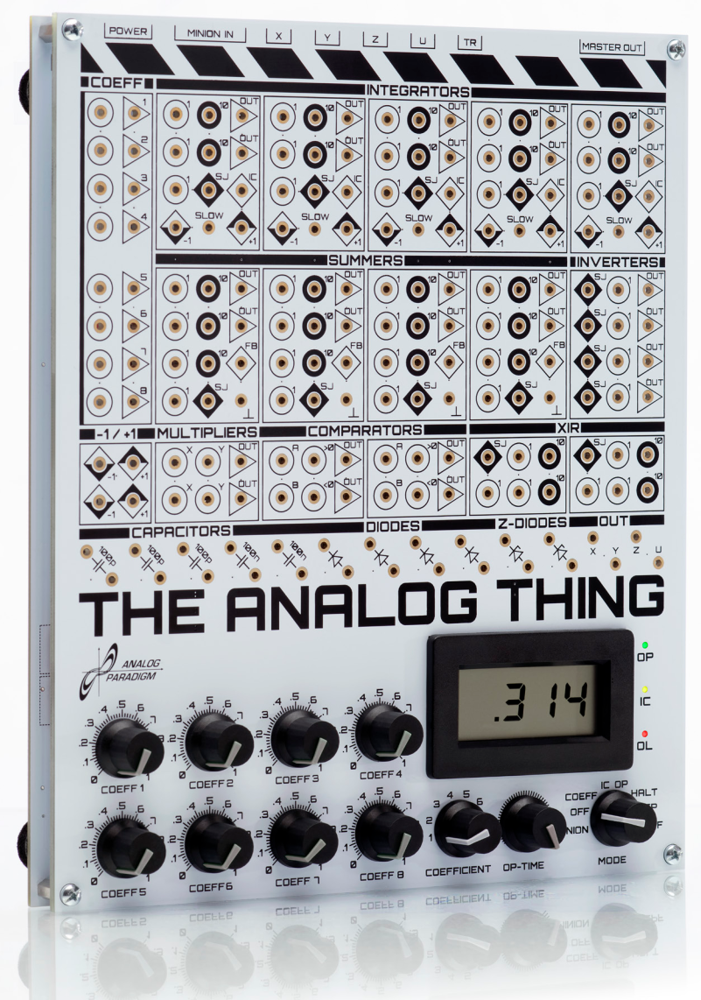

.. THAT_wiki documentation master file, created by
   sphinx-quickstart on Fri Feb  4 11:16:11 2022.
   You can adapt this file completely to your liking, but it should at least
   contain the root `toctree` directive. :-)
   
**The Analog Thing**
====================

**Note: Work in progress! Missing articles will be filled within the next weeks.**

Welcome to the THAT website, a homepage generated and maintained by anabrid GmbH.

Computing today is a digital monoculture. We at anabrid want to see a comeback of analog computing and, eventually, an analog-digital hybrid computing future because:

- Analog computing is vastly more energy-efficient than digital computing [1], promising to lower our computational CO 2 footprint and energy costs significantly.
 
- As the exponential growth of digital computing power described by Moore’s Law approaches its limits [2], analog-digital hybrid technology promises to sustain growth in computer performance for decades to come.
 
- Analog computing may protect critical infrastructure by reducing attack surfaces of online operational technology and by offering failover options. [3]
 
- Analog computing is an excellent way to learn about mathematics, science, and engineering. [4]
 
You are invited to join the quest to bring analog computing back. THE ANALOG THING (or simply THAT) is here to get you started. THAT is a high-quality, low-cost, open-source, and not-for-profit cutting-edge analog computer. It computes with continuous voltages rather than with zeroes and ones. Capable of solving (sets of) differential equations, it allows a broad range of dynamic systems to be modeled. This website offers guidance to users taking first steps with THAT, focusing on the qualitative rather than quantitative aspects of analog computing. We hope you see this website, along with THAT, and its community of users as enjoyable resources in your learning inquiries and in our shared quest to make computing more diverse!

 [1] Jennifer Hasler (2016). Opportunities in physical computing driven by analog realization, 2016 IEEE Int’l Conference on Rebooting Computing, San Diego, CA.
 
 [2] John L. Hennessy and David A. Patterson (2019). Computer Architecture. A Quantitative Approach, 6th edition, Morgan Kaufmann, Cambridge, MA, p. 3. 
 
 [3] Daniel E. Geer Jr. (2018). A Rubicon, Hoover Working Group on National Security, Technology, and Law, Aegis Paper Series No. 1801.

 [4] George F. Lang (2000). Analog was not a computer trademark! Sound and Vibration, August 2000, 16–24.
 

.. raw:: latex

    \newpage
    

.. image:: rst/images/frontpage/THAT_021.jpg
  :width: 750
  :alt: Alternative text
  :align: left
   
   
==============================
**The Analog Thing: Overview**
==============================
   

.. toctree::
   :maxdepth: 1
   :caption: Electrical analog computer basics:
   :titlesonly:
   

   rst/basics_computing_elements
   rst/basics_operation_modes
   rst/basics_programming
   rst/basics_visualization
   rst/basics_differential_equations
   rst/basics_quickstart
   
   

.. toctree::
   :maxdepth: 2
   :caption: Applications:
   :titlesonly:
   
   rst/applications
   

.. toctree::
   :maxdepth: 2
   :caption: History:
   
   rst/history_mechanical_analog_computers
   rst/history_first_electronic_analog_computers
   rst/history_system_examples_1950-now

.. Indices and tables
   ==================

   * :ref:`genindex`
   * :ref:`modindex`
   * :ref:`search`
