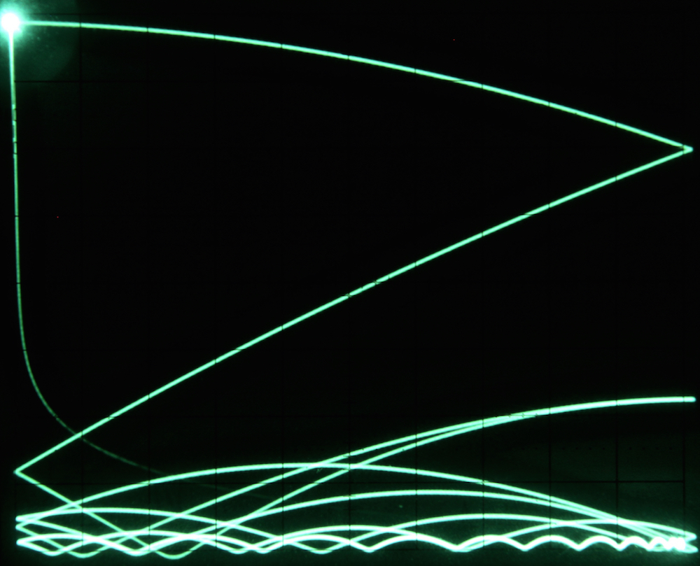

.. contents::
   :depth: 3

========================
High-speed Bouncing Ball
========================

Introduction
============

This application note describes the simulation of a ball bouncing in a
box. Using high-speed integration, a flicker-free oscilloscope display
of the ball’s path can be easily obtained. Figure
`[pic_movement] <#pic_movement>`__ shows the basic idea of the
simulation: The bounding box is assumed as
:math:`\left[-1:+1\right]\times\left[-1:+1\right]`, and the position of
the ball within this box is described by the coordinate tuple
:math:`(x,y)`. At the start of a simulation run, the ball can have two
initial conditions, an initial velocity :math:`v_0` (which is not used
in the example below), and an initial :math:`y`-position :math:`y_0`,
set to :math:`1` in the following.

The :math:`x`- and :math:`y`-components of the ball’s position are
assumed as being completely independent, so they can be generated by two
separate computer circuits. The :math:`x`-component of the ball’s
velocity is assumed to decrease linearly over time. The actual
:math:`x`-position of the ball is derived by integrating over its
velocity. Every time the ball hits the left or right wall of the box, it
changes its direction (i. e. it is reflected by the wall).

The :math:`y`-component is that of a free-falling ball which bounces
back elastically when hitting the floor. Figure `[pic_xy] <#pic_xy>`__
shows those two variables over time as displayed on an oscilloscope:
Starting from the left, the computer is first in IC-mode. As soon as the
OP-mode starts, the ball begins to drop until it hits the floow while
the :math:`x`-component increases linearly (trace in the middle) until
it reaches the right wall etc.

.. list-table::
   :widths: 75 75
   :header-rows: 0

   * - .. figure:: fig01.png
   		:align: left
   		:width: 400
     - .. figure:: fig02.jpg
   		:align: right
   		:width: 400
		:height: 400
		
   * - Movement of the bouncing ball
     - x- and y-component of the bouncing ball
   
.. list-table::
   :widths: 75 
   :header-rows: 0
   
   * - .. figure:: fig03.png
   		:width: 800
       
   * - Generating the x-component

Programming and results
=======================

Figure `[pic_x_circuit] <#pic_x_circuit>`__ shows the computer setup to
derive the :math:`x`-component of the ball’s position. At the output of
the leftmost integrator is the velocity :math:`v_x` of the ball which
starts at :math:`+1` and decreases linearly, controlled by the
:math:`\Delta v`-potentiometer. (The diode at the output of the
integrator is not really necessary but it makes setting up parameters a
bit more easy as it prevents a negative velocity.)

The sign-reversal of the :math:`x`-component of the ball, triggered by
hitting the left or right wall, is implemented by two comparators: One
switches between the normal or inverted output of the left integrator
while the other one yields the comparison value to detect the two walls
of the box. The integrator on the right yields the :math:`x`-component
by integrating over :math:`v_x`. Its output is fed to the
:math:`x`-input of an oscilloscope set to :math:`X/Y`-display mode. The
time-constants of the integrators are set to :math:`10^2` and
:math:`10^3` respectively.

The :math:`y`-component of the ball’s movement can be described by the
following differential equation:

.. math::

   \ddot{y}=-g+d\dot{y}
       \left\{
        \begin{array}{l}
         +c\left(-y+1\right)\quad\text{if}\ y<-1\\
         \\
         -c\left(y-1\right)\quad\ \ \text{if}\ y>1.
        \end{array}
       \right.

The case :math:`y>1` cannot happen in this simulation as there is no
initial velocity of the ball to be taken into account. At the beginning
of a simulation run, the ball starts falling due to gravity :math:`g`.
It is decelerated by air friction which is proportional to its velocity
:math:`\dot{y}`. This damping coefficient will be denoted by :math:`d`
in the following.

When the ball hits the floor of the box it will rebound due to elastic
collision described by the term :math:`c(-y+1)` with a constant
:math:`c`.

Figure `[pic_y_circuit] <#pic_y_circuit>`__ shows the corresponding
computer setup. The leftmost integrator integrates over the gravity
:math:`g` and also takes the air friction :math:`d` into account. It
yields the negative :math:`y`-component :math:`v_y` of the ball’s
velocity. The integrator on the right integrates over :math:`v_y`,
yielding the actual :math:`y`-position.

The elastic rebounce is implemented by means of two diodes. The “active”
element here is the :math:`10` V Zener-diode which starts conducting
when the ball hits the floor of the box. The diode on the left makes
sure that the Zener-diode won’t conduct while the ball is within the
box. Since the rebound effect is rather violent, the output of the two
diodes connected in series is directly connected to the summing junction
input (SJ) of the first integrator. The time-constants of the
integrators are both set to :math:`10^2`.

Figure `[pic_setup] <#pic_setup>`__ shows the setup of this program on a
small Analog Paradigm Model-1 analog computer. The two circuits
described above are implemented using differently colored patch cables.
The black cables correspond to the :math:`x`-circuit while the orange
wires implement the :math:`y`-circuit.

.. figure:: setup.jpg
   :alt: Setup of the bouncing ball problem on an Analog Paradigm
         Model-1 analog computer
         
Setup of the bouncing ball problem on an Analog Paradigm Model-1 analog computer

With the settings as denoted in the circuit diagrams and the computer
set to repetitive operation with an OP-time of :math:`20` ms and short
IC-time, a display such as that shown in figure `[pic_bb] <#pic_bb>`__
can be easily obtained. Since the oscilloscope used has no
blanking-input, the return of the beam to the upper left corner is
faintly visible. If a blanking-input is available it can be connected to
the TRIG+ or TRIG- output of the CU to avoid this artifact.

   Trace of the bouncing ball
