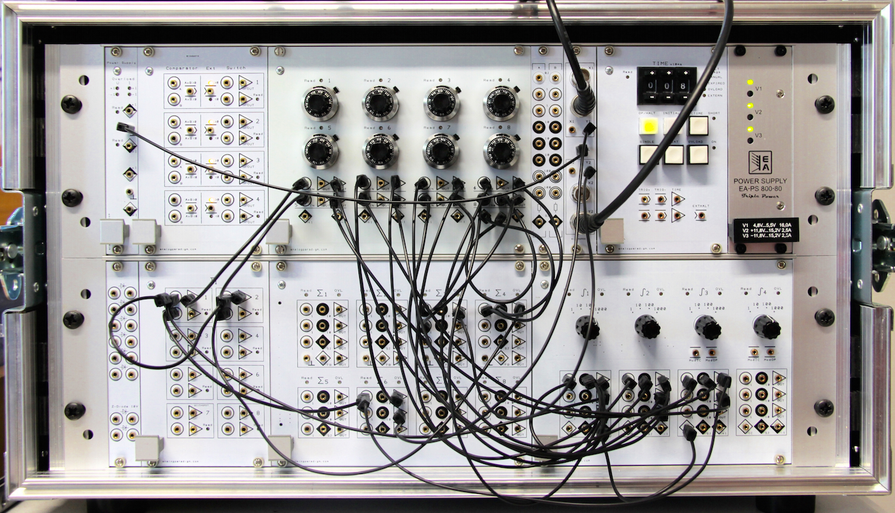
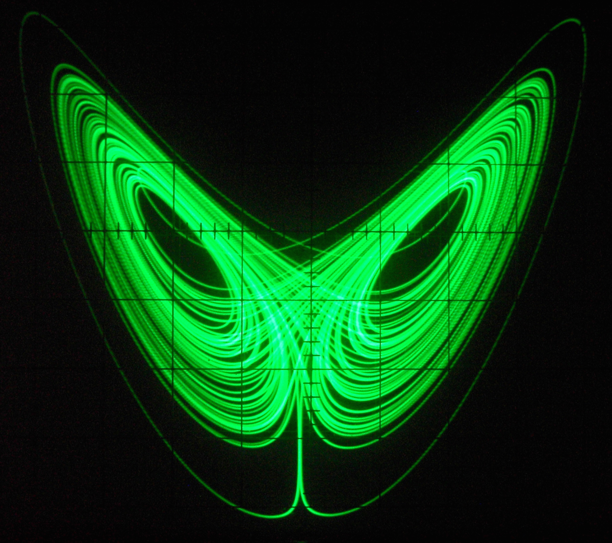
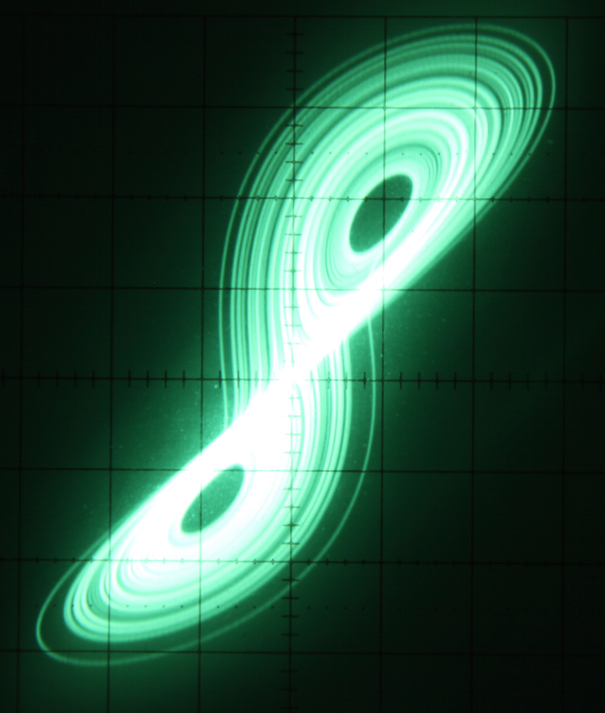
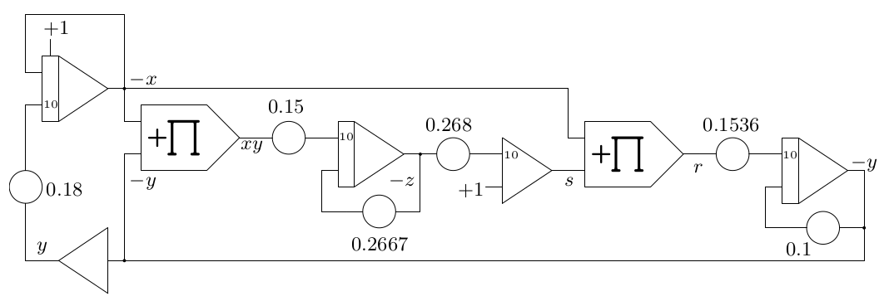
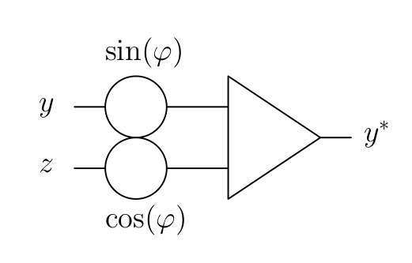

.. role:: raw-latex(raw)
   :format: latex

.. contents::
   :depth: 3

=====================
Lorenz-attractor [1]_
=====================

Introduction
============

This issue 2 of “Analog Computer Applications” deals with one of the
most intriguing and well known chaotic attractors, the so-called
Lorenz-attractor or -system. It was developed in 1963 by Edward Norton
Lorenz\  [2]_ as a simplified model for atmospheric convection and first
described in :raw-latex:`\cite{lorenz}`. Although this seminal work
was performed on a digital computer, a Royal McBee LGP-30, the
Lorenz-attractor is ideally suited to be implemented on an analog
computer.

Scaling
=======

This dynamic chaotic attractor is described by three coupled
differential equations of the form [3]_

.. math::

   \begin{aligned}
      \dot{x}&=\sigma(y-x)\\
      \dot{y}&=x(\rho-z)-y\\
      \dot{z}&=xy-\beta z,
     \end{aligned}

where :math:`\sigma=10, \beta=\frac{8}{3}`, and :math:`\rho=28`.
Obviously, this set of DEQs is not directly suitable for an analog
computer as it is not properly scaled. Scaling the equations of systems
like this is not a trivial task. First, the domains of the variables
have to be determined. This can either be done manually on an analog
computer, starting with unscaled equations and running until an overload
condition arises. Then the offending variable is determined and a
guesstimated scale factor for this particular variable introduced.
Alternatively, a digital computer even employing simple integration
schemes like the first-order Euler-integration can be used in this step.
As soon as minimum/maximum values for the variables are (roughly)
determined, the equations can be scaled by introducing appropriate
scaling factors.

The equations above were transformed and scaled as follows for
implementation on an analog computer:

.. math::

   \begin{aligned}
      x&=\int1.8y-x\ \mathrm{d}t+C\\
      s&=1-2.678z\\
      y&=\int1.5556xs-0.1y\ \mathrm{d}t\\
      z&=\int1.5xy-0.2667z\ \mathrm{d}t.
     \end{aligned}

:math:`C` denotes the initial condition of the integrator yielding
:math:`x` and is quite uncritical. Taking into account that every summer
and integrator of an analog computer performs an implicit change of
sign, and further noting that :math:`xy=-x(-y)`, these equations can be
further simplified a bit, saving two inverters in the resulting computer
setup:

.. math::

   \begin{aligned}
       -x&=-\int1.8y-x\ \mathrm{d}t+C\\
       -z&=-\int1.5xy-0.2667z\ \mathrm{d}t\\
       s&=-\left(1-2.68z\right)\\
       r&=-xs\\
       -y&=-\int1.536r-0.1y\ \mathrm{d}t.
      \end{aligned}

Setup
=====

These equations can now readily implemented on a decent analog computer
like the minimal Analog Paradigm Model-1 shown below:

|image1|

The corresponding schematic looks like this:

|image4|

Results
=======

Depending on the time constant :math:`k_0` set for the integrators,
either a mechanical :math:`x/y`-plotter or an oscilloscope may be used
to get a graphical representation of this chaotic attractor. The
following pictures give some impressions of various projections of this
attractor using the following circuit with appropriate values set for
:math:`\sin(\varphi)` and :math:`\cos(\varphi)`:

|image5|

|image2| |image3|

9 Christian Kuehn, *Multiple Time Scale Dynamics*, Springer, 2015 Edward
Norton Lorenz, “Deterministic Nonperiodic Flow”, in *Journal of the
Atmospheric Sciences*, Volume 20, pp. 130–141, March 1963

.. [1]
   The author would like to thank Mr. David Broadbent for his valuable
   suggestions and improvements.

.. [2]
   May 23, 1917, April 16, 2008

.. [3]
   As always, a dot over a variable denotes the time-derivative, i. e.
   :math:`\dot{x}=\frac{\mathrm{d}x}{\mathrm{d}t}`.

