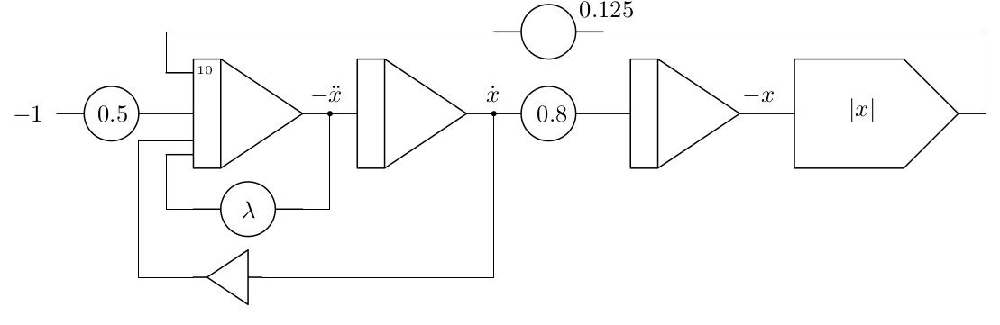
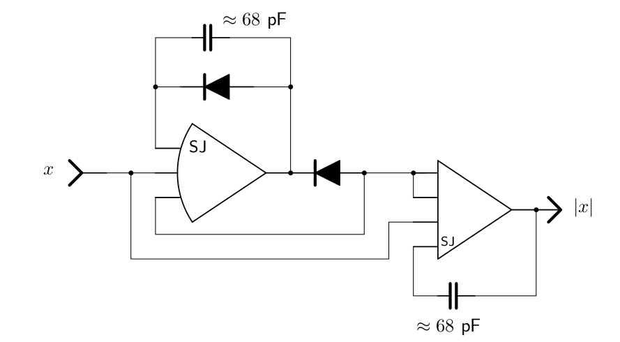
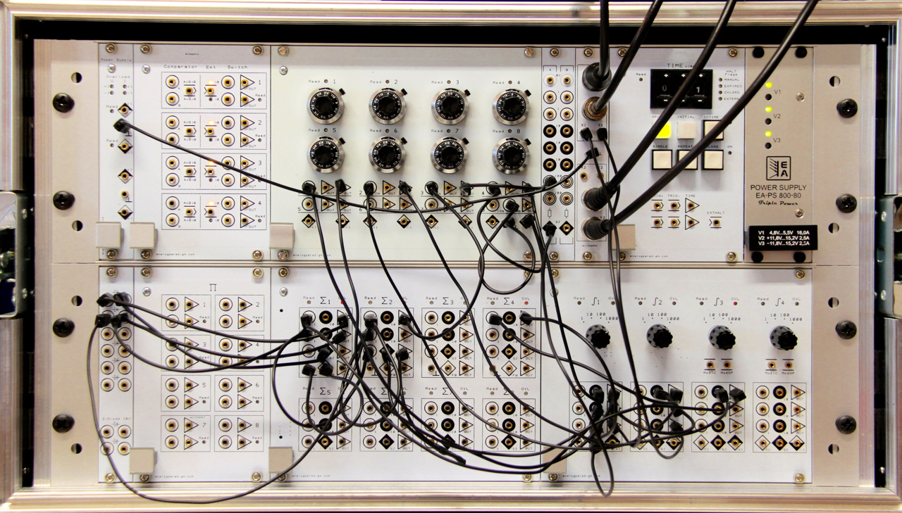
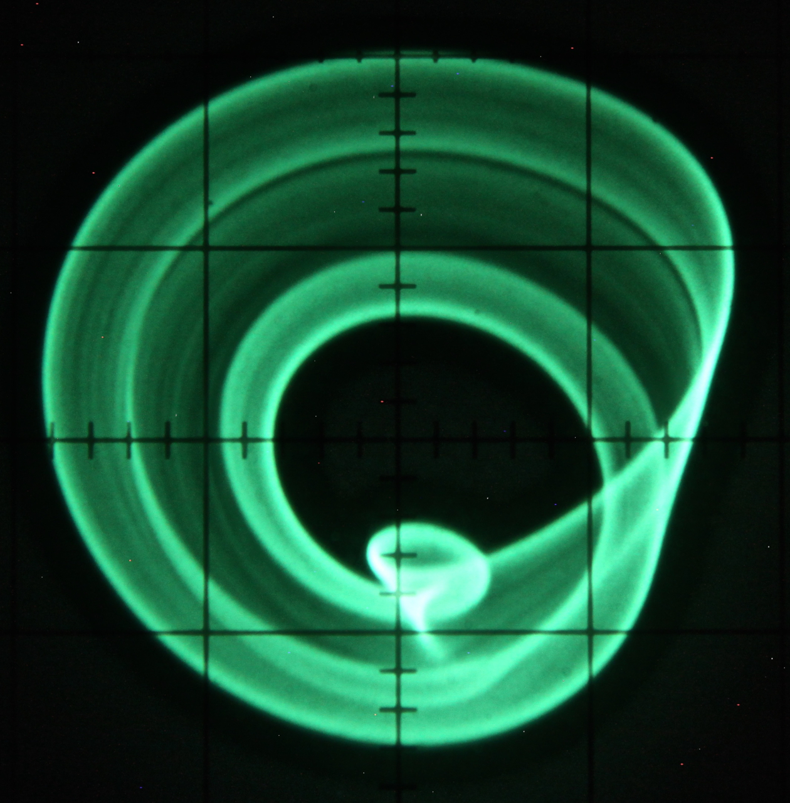

.. role:: raw-latex(raw)
   :format: latex

.. contents::
   :depth: 3

===============
Nonlinear chaos
===============

An interesting chaotic system based on an absolute value function as the
central nonlinear element has been described in
:raw-latex:`\cite{kiers}`. It is described by

.. math:: \dddot{x}=-\lambda\ddot{x}-\dot{x}+|x|-1.

This chaotic system is quite remarkable as it only has one parameter,
:math:`\lambda`, controlling its behaviour.

As written above values can get as big as about :math:`2.5`, so the
equation has to be scaled in order to be implemented on an analog
computer. Figure `[pic_abs_chaos_program] <#pic_abs_chaos_program>`__
shows the scaled program. The time constants of the integrators are set
to :math:`k_0=10^3`.

If no absolute value function is readily available on the analog
computer being used, it can be setup as shown in figure
`[pic_abs_function] <#pic_abs_function>`__. The two capacitors shown
stabilize the two summers and can be left out if there are no wild
oscillations without them. Their value is quite uncritical and should be
of the order of some :math:`10` pF.

Figure `[pic_abs_chaos_setup] <#pic_abs_chaos_setup>`__ shows the
completed setup on an Analog Paradigm Model-1 analog computer. An
example of a phase-space plot of this chaotic system with
:math:`\lambda\approx0.62` is shown in figure
`[pic_abs_chaos] <#pic_abs_chaos>`__. Here, :math:`-\ddot{x}` and
:math:`\dot{x}` have been fed to the :math:`x`- and :math:`y`-inputs of
the oscilloscope.

Nonlinear chaos circuit patched on an Analog Paradigm Model-1 analog computer

Phase-space plot of the chaotic attractor

9 Ken Kiers, Tim Klein, Jeff Kolb, Steve Price, “Chaos in a nonlinear
analog computer”, in *International Journal of Bifurcation and Chaos*,
Vol. 14, No. 8 (2004), pp. 2867–2873
