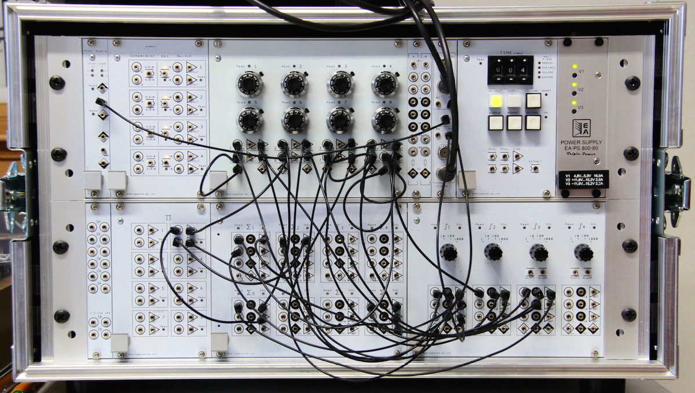
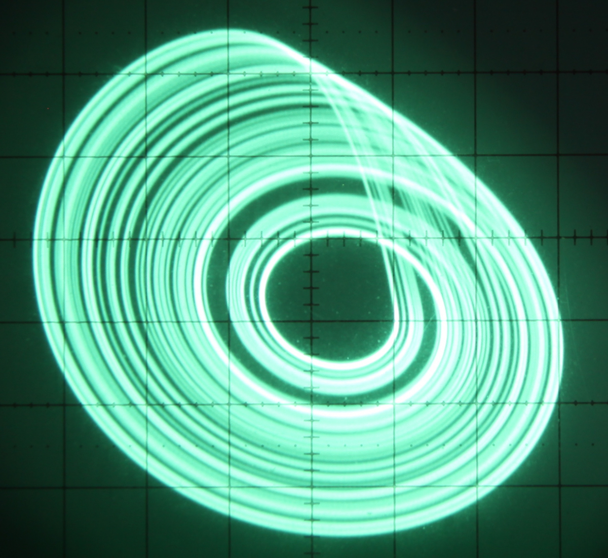
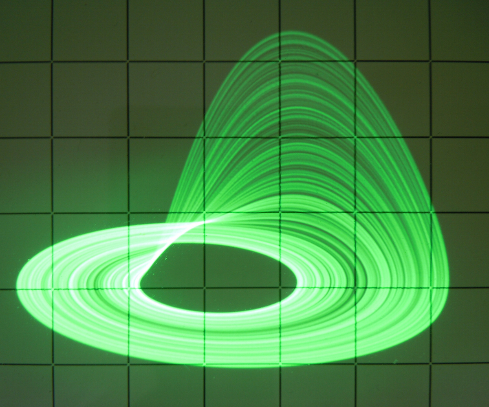
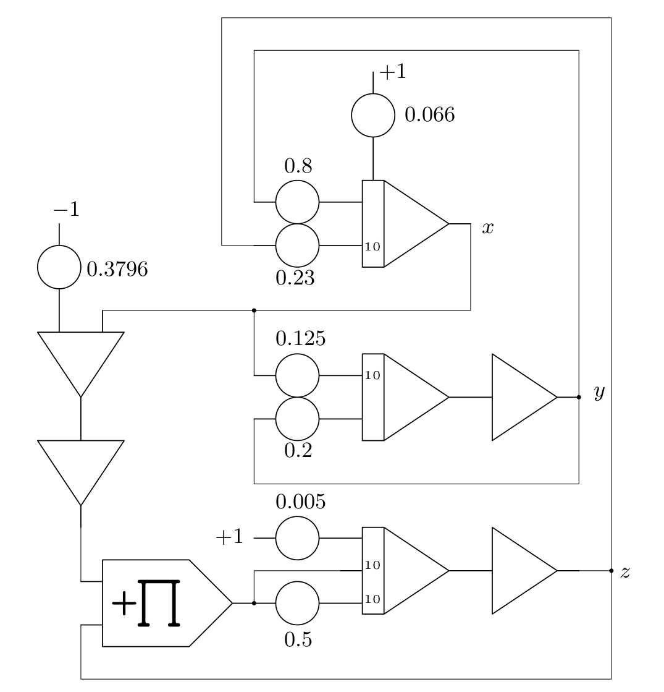
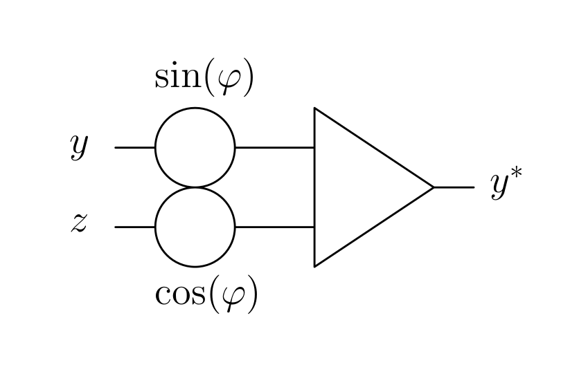

.. contents::
   :depth: 3

Rössler-attractor [1]_
======================

An electronic analog computer is ideally suited to study continuous-time
dynamical systems of which those showing chaotic behavior are not only
quite interesting but also yield aesthetically pleasing phase space
plots. The particular system treated below was developed and studied in
1976 by Otto Rössler. [2]_ This system is described by the following
three coupled differential equations (DEQ)

.. math::

   \begin{aligned}
     \dot{x}&=-(y+z)\\
     \dot{y}&=x+ay\\
     \dot{z}&=b+z(x-c),
    \end{aligned}

where :math:`a=1/5, b=1/5`, and :math:`c=5.7`. [3]_ A remarkable
property of this particular system is that two of its three defining
DEQs are linear.

Since variables in an analog computer are limited to the co-domain
:math:`[-1:+1]` with :math:`-1` and :math:`+1` denoting the so-called
*machine units* which are most often represented by
:math:`\pm10` V, [4]_ these equations must be scaled before setting up
the computer. The main objective of scaling is to make sure that no
variable exceeds :math:`[-1:+1]`. In addition to that it is desirable
that each variable takes on values of an as large subinterval of
:math:`[-1:+1]` as possible in order to obtain the maximum precision
from the analog computer.

| The final set of scaled coupled DEQs for this problem looks like this:

.. math::

     \begin{aligned}
       \dot{x}&=-0.8y-2.3z\\
       \dot{y}&=1.25x+a^*y\\
       \dot{z}&=b^*+15z(x-c^*),
      \end{aligned}

where :math:`a^*=0.2, b^*=0.005`, and :math:`c^*=0.3796`. The
resulting computer setup is shown below:

|image4|

A typical analog computer setup for this circuit is shown below, the
machine used is a minimal Model-1 from Analog Paradigm:

|image1|

The following photograph shows an :math:`x`-:math:`y`-plot of the
attractor, photographed with ISO 100 and time constant :math:`k_0=10^3`
set on all three integrators involved:

|image2|

A beautiful picture can be obtained with a simple (static) 3d-projection
of the attractor. Here :math:`x` feeds one input of the oscillosope
which is set to :math:`xy`-mode, while the other input is fed from a
summer yielding

.. math:: y^*=-(y\sin(\varphi)+z\cos(\varphi)),

where the sine/cosine terms are directly set by coefficient
potentiometers:

|image5|

Using these two coefficient potentiometers the angle of view is
adjustable at will – one particular setting resulted in the following
picture:

|image3|

.. [1]
   I would like to thank professor Michael Brisk for spotting and
   correcting some errors in this article.

.. [2]
   20th May 1940

.. [3]
   :math:`\dot{x}` denotes the first derivative of :math:`x` with
   respect to time: :math:`\frac{\mathrm{d}x}{\mathrm{d}t}` etc.

.. [4]
   Vacuum tube based analog computers normally offered a voltage range
   of :math:`\pm100` V.

