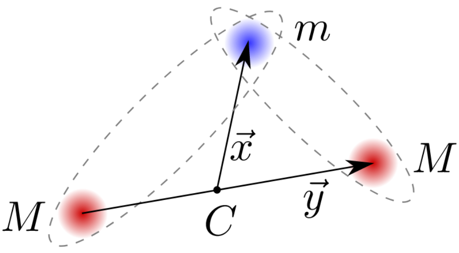
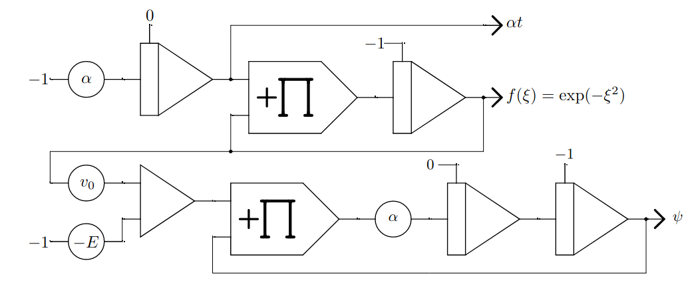
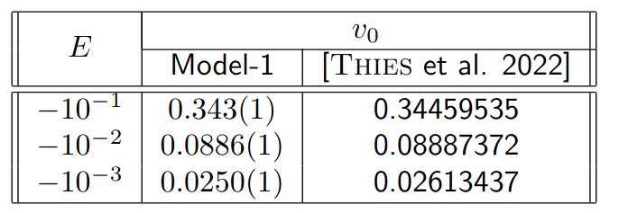

===========================================================
Quantum Mechanical Two-Body Problem with Gaussian potential
===========================================================

.. contents::
   :depth: 3
..

.. container:: center

   **Quantum Mechanical Two-Body Problem with Gaussian potential**

   *Figure 1: Two heavy (M) particles and one light (m) particle in a three-body system*

This application note is inspired by the work described in
[Thies et al. 2022]. In this paper the authors develop a numerical
method to calculate binding energies of a quantum mechanical three-body
system efficiently. This three-body system is composed of two heavy and
one light particle. In figure `1 <#fig:ThreeBodySystem>`__ the system is
displayed with its two-body (heavy/light) subsystems marked by dashed
ellipses. The routine to calculate binding energies for the three-body
system first solves the two-body subsystem. This application note aims
to reproduce the findings in :raw-latex:`\cite{thies}` for the two-body
systems using an analog computer.

Implementation
==============

The Schrödinger equation for the two-body system is given by

.. math::

   \begin{align}
     \left[ -\frac{1}{2} \Delta_\xi - v_0 f(\xi) \right] \psi(\xi) &= E\psi(\xi),\tag{1} \label{eq:schrödinger}
   \end{align}

where :math:`\xi` is the distance between the two particles, :math:`E`
their energy, :math:`\psi(\xi)` the wave function of the system,
:math:`-v_0f(\xi)` an attractive potential between the particles, and
:math:`\Delta_\xi` the Laplace operator. The depth of the potential is
given by :math:`v_0` and the shape is defined by a Gauss\ ian function

.. math::

   \begin{align}
     f(\xi) = \exp(-\xi^2). \tag{2}
   \end{align}

With a Gauss\ ian potential equation (1) becomes symmetric under the transformation :math:`\xi \rightarrow -\xi`
and the solutions are either even (:math:`\psi(\xi) = \psi(-\xi)`) or
odd (:math:`\psi(-\xi) = -\psi(\xi)`). Hence, equation (1) can be solved for :math:`\xi>0`
with initial conditions of either :math:`\psi(0)\neq 0` and
:math:`\psi'(0) = 0` (even) or :math:`\psi(0) = 0` and
:math:`\psi'(0)\neq 0` (odd).

*Figure 2: Analog computer program solving the Schr ̈odinger equation with Gaussian potential.*

In figure 2 the analog program to solve equation (1) is shown. In the upper half the
Gaussian function is generated by solving the differential equation

.. math::

   \begin{align}
     \frac{\text{d}}{\text{d}\xi}f(\xi) = -2\xi f(\xi),\hspace{1cm}\text{and}\hspace{1cm} f(0)=1. \tag{3} \label{eq:diffGaussian}\end{align}

One has to be careful about the variable of interest in equations such
as (3) because
:math:`\frac{\text{d}}{\text{d}\xi} \neq \frac{\text{d}}{\text{d}t}`
(all integrators integrate over time).

In the following :math:`\xi` is defined as
:math:`\xi = \sqrt{\frac{\alpha}{2}} t`, implying
:math:`\frac{\text{d}}{\text{d}\xi} = \sqrt{\frac{2}{\alpha}} \frac{\text{d}}{\text{d}t}`.
With this eq. (3) can be rewritten as

.. math::

   \begin{align}
     \sqrt{\frac{2}{\alpha}} \frac{\text{d}}{\text{d}t}f(\xi) &= -2  \sqrt{\frac{\alpha}{2}} t f(\xi) \notag \\
     \Leftrightarrow \frac{\text{d}}{\text{d}t}f(\xi) &= -\alpha t f(\xi)
                                                        \hspace{1cm}\text{and}\hspace{1cm} f(0)=1. \tag{4} \label{eq:diffGaussian2}\end{align}

The implementation of eq. (4) can directly be seen in the upper half of the analog program in figure 2. The lower half implements the two-body Schrödinger equation in eq. (1). To
see this correspondence the equation can be rewritten:

.. math::

   \begin{align}
     \frac{\text{d}^2}{\text{d}\xi^2} \psi(\xi) &= -2 \left[v_0f(\xi) + E \right]\psi(\xi) \tag{5}\\
     \Leftrightarrow \hspace{0.5cm} \left( \sqrt{\frac{2}{\alpha}} \right)^2 \frac{\text{d}^2}{\text{d}t^2} \psi(\xi)
                                                &=  -2 \left[v_0f(\xi) + E \right]\psi(\xi) \tag{6}\\
     \Leftrightarrow \hspace{2.2cm} \frac{\text{d}^2}{\text{d}t^2} \psi(\xi)
                                                &=  -\alpha \left[v_0f(\xi) + E \right]\psi(\xi). \tag{7} \label{eq:schrödImpl}\end{align}

The implementation of eq. (7) in the lower half of figure (2) is straightforward. The potentiometer for :math:`E` gets a negative
reference input since for a positive potential depth :math:`v_0>0` the
wave function :math:`\psi` is only bound if the energy is negative. The
initial conditions for :math:`\psi` in figure (2) are set to generate even solutions.

Calculation
===========

In :raw-latex:`\cite{thies}` binding energies for the three-body system
are calculated for values of the potential depth :math:`v_0` for which
the two-body subsystem has specific energy values. So for a given energy
one is interested in the value of :math:`v_0`, or in other words the
strength of the attractive force between the two particles, for which
the two-body system is bound.

A system is in a bound state, if its wave function :math:`\psi` remains
localized. This implies that for large values of :math:`\xi`,
:math:`\psi` tends to zero
(:math:`\lim_{\xi\rightarrow \pm \infty} \psi(\xi) = 0`). In the
following two-body energies of :math:`E=-10^{-1},-10^{-2},-10^{-3}` are
investigated. The potential depth :math:`v_0` required for the system to
be in a bound state can be derived by varying :math:`v_0` until
:math:`\psi` is localized.

This process in depicted in figure 3. The
program is set up for :math:`E=-0.1` and :math:`\alpha=0.1` on an Analog
Paradigm Model-1. All integrators have a time scale factor of
:math:`k_0 = 10^4` with the exception of two integrators with an
:math:`\alpha=0.1` scaling in front, which is absorbed into the time
scale factor by setting :math:`k_0 = 10^3`. With this setup the effect
on :math:`\psi` by varying :math:`v_0` can be tested and a bound state
of the system can be derived.

.. list-table::
   :widths: 75 75
   :header-rows: 0

   * - .. image:: Run1.png
     	      :width: 500
  	      :alt: Alternative text
  	      :align: center
     - .. image:: Run2.png
     	      :width: 500
  	      :alt: Alternative text
  	      :align: center

*Figure 3: Two runs of the analog program for E = −0.1 and α = 0.1*

In figure 3 it can be seen that even very slight changes of :math:`v_0` affect :math:`\psi`. Both of the states
are not bound states, because
:math:`\lim_{\xi\rightarrow \pm \infty} \psi(\xi) \neq 0`. However, the
two states in figure 3 suggest that for some
value of :math:`v_0` between :math:`0.342` and :math:`0.343` there is a
bound state. With this process regions of :math:`v_0` for different
values of :math:`E`, in which the system is bound, can be derived.

*Table 1: Values of v0 at different energies E. Results from the Model-1 analog computer are compared with results from [Thies et al. 2022].*

Results
=======

In table 1 the results from the analog
computer are compared with the results in :raw-latex:`\cite{thies}`. The
values of :math:`v_0` derived by the analog computer setup are all close
the theoretical values. For :math:`E=-0.1` and :math:`E=-0.01` the
deviations are less than :math:`0.5\%` and for :math:`E=-10^{-3}` it is
about :math:`5\%`. The uncertainties given for values of :math:`v_0`
from the Model-1 are derived from the variation of :math:`v_0` around
the bounded state of :math:`\psi`. Uncertainties of the analog program
due to the limited precision of analog components are not analysed.

References
==========

   [Thies et al. 2022] Jonas This, Moritz Travis Hof, Matthias Zimmermann, Maxim Efremov,
   “Tensor Product Scheme for Computing of Bound States of the Quantum
   Mechanical Three-Body Problem”, https://arxiv.org/pdf/2111.02534.pdf,
   2022

