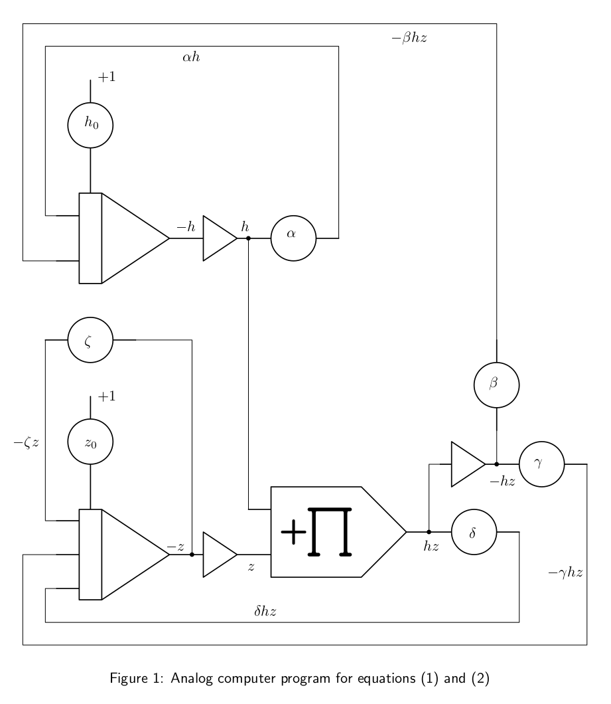
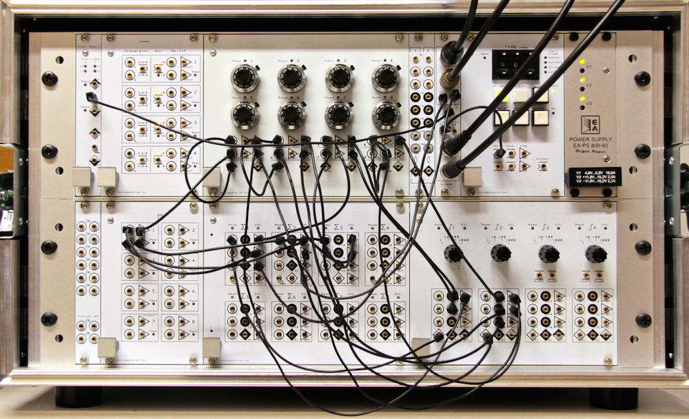
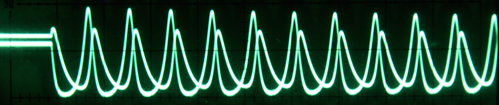

.. role:: raw-latex(raw)
   :format: latex

.. contents::
   :depth: 3

=====================
Zombie Apocalypse Now
=====================

Introduction
============

How could one not like zombie movies? It was about time that someone,
Robert Smith? and his collaborators, shed some light on zombie attacks
from a mathematical point of view (see :raw-latex:`\cite{smith}`). Phil
Munz (see :raw-latex:`\cite{munz}`) applied a well-known coupled set of
differential equations to this particular problem, that was
independently developed by Alfred James Lotka and Vito Volterra in the
late 19th/early 20th century. Although Volterra and Lotka were
interested in (closed) eco-systems, their equations are ideally suited
to model a world infested by zombies. Whenever there is a problem which
is readily described by (coupled) differential equations, an analog
computer is the ideal tool to tackle them as we will do in the
following.

Programming
===========

The mathematicsl model itself is quite straightforward and consists of
the following two coupled differential equations:

.. math::

   \begin{aligned}
      \frac{\mathrm{d}h}{\mathrm{d}t}&=\alpha h-\beta hz\label{equ_z1}\\
      \frac{\mathrm{d}z}{\mathrm{d}t}&=\delta hz-\gamma hz-\zeta z\label{equ_z2}
     \end{aligned}

:math:`h` and :math:`z` represent the number of humans and zombies,
respectively. :math:`h_0` and :math:`z_0` are the initial conditions.
The remaining parameters are

:math:`\alpha`: Growth rate of the human population (birthrate).

:math:`\beta`: Factor describing the rate at which humans are killed by zombies.

:math:`\delta`: Growth factor of zombie population due to zombies killing humans and thus transforming them into zombies.

:math:`\gamma`: Rate at which zombies are killed by humans.

:math:`\zeta`: Normal “death” rate of the zombie population.

Figure 1 shows the resulting program for the two equations  while figure 2 shows the program as
implemented on an Analog Paradigm Model-1 analog computer.

   Zombie simulation on an Analog Paradigm Model-1 analog computer

Results
=======

Figure 3 shows a typical result obtained with the setup described above. The computer was run in
repetitive mode with the time-constants of the integrators set to
:math:`k_0=10^3`. Additionally, only integrator inputs with a weight of
:math:`10` were used, further speeding up the simulation by another
factor of :math:`10`. The IC-time was set to short, and the OP-time to
:math:`60` ms. The oscilloscope was explicitly triggered with one of the
TRIG-outputs of the CU to obtain a stable, flicker-free display.

Results of a typical zombie simulation.

The parameters were derived experimentally by playing with the various
coefficients until a stable behaviour was obtained. The output shown was
generated with :math:`h_0=z_0=0.6`, :math:`\alpha=0.365`,
:math:`\beta=0.95`, :math:`\delta=0.84` (very successful zombies,
indeed), :math:`\gamma=0.44`, and :math:`\zeta=0.09`.
