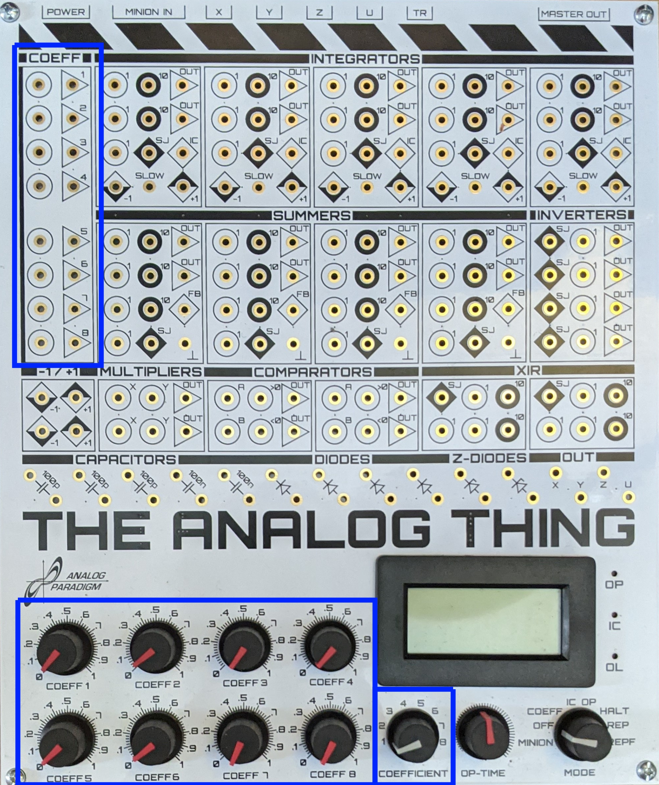

Coefficient potentiometer
=========================

.. list-table::
   :widths: 75 75
   :header-rows: 0

   * - .. image:: ../../images/computing_elements/potentiometercircuit.png
     	      :width: 250
  	      :alt: Alternative text
  	      :align: center
     - .. image:: ../../images/computing_elements/potentiometersymbol.png
     	      :width: 350
  	      :alt: Alternative text
  	      :align: center  	      
   * - Electrical circuit
     - Potentiometer circuit symbol
  	      
  	            	  	
The simplest and only passive standard component ist the **coefficient petentiometer**.

Commonly realized as precision potenetiometer connected as voltage divider, it is used to multiply a given input with a value between 0 and 1, so :math:`a*x` is generated.

It can also be used as dividing factor so :math:`\frac{x}{a}` is generated.

**Round/circular panel –> Input**

**Triangular panel –> Output**

    
    
    
In the upper blue box are the coefficient potentiometer in- and outputs.

In the lower left blue box are the actual potentiometers used to set the coeffcients to the desired value.

In the lower right blue box is the coefficient selector. When the THAT is set in **COEFF** mode, the panel meter displays the exact value of the corresponing potentiometer set by the coefficient selector.
