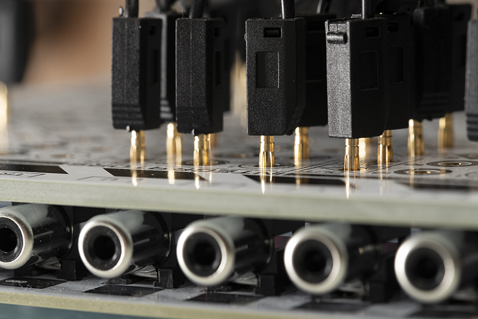

================================
Frequently asked questions (FAQ)
================================

What is analog computing?
-------------------------

Analog computing is an alternative to digital computing; ideally suited for dynamic systems modeling; ideally suited for neuromorphic AI applications; much more energy-efficient than digital computing; inherently safer than digital computing in the face of cyber threats; a great, hands-on way to learn about maths, engineering and systems; and simply an eye-opening experience.

What is THE ANALOG THING?
-------------------------

THE ANALOG THING is a high-quality, low-cost, open-source, and not-for-profit cutting-edge analog computer. You can think of it as a kind of Raspberry Pi that computes with continuous voltages rather than with zeroes and ones.

What is "THAT"?
---------------
THAT is an abbreviation of THE ANALOG THING.

Who is the team behind THAT and what is their motivation?
---------------------------------------------------------

THAT is developed and distributed by the German tech start-up company anabrid under the brand name Analog Paradigm. Anabrid is planning to develop an analog computer on-a-chip to diversify today's digital computing monoculture with analog-digital hybrid computing. To support this initiative, anabrid uses its Analog Paradigm brand to promote the often much more efficient and safer analog computing paradigm. THAT is Analog Paradigm's response to the need for education and community activity around analog computing. In contrast to the Analog Paradigm Model 1 analog computer, THAT is small, highly affordable, open-source, and not-for-profit. It is analog computing for the future, for all. Analog Paradigm welcomes community contributions to THAT hardware, accessories and documentation.

What can I do with THAT?
------------------------

THAT is typically used to model dynamic systems, i.e., systems that change in time according to some causal relationships. Examples include including market economies, the spread of diseases, population dynamics, chemical reactions, mechanical systems, the firing of neurons, a variety of mathematical attractors, and much more. Technically, THAT solves (sets of) differential equations by way of integration, and it produces results in the form of graphs representing relationships between dependent and independent variables. If you are not familiar with differential equations, then THAT is an excellent tool to familiarize yourself with them. You can use THAT for a variety of purposes: You can use it to predict in the natural sciences, to control in engineering, to explain in educational settings, to imitate in gaming, or you can use it for the pure joy of it. THAT can help you understand what is (models of), and it can help you bring about what should be (models for). More fundamentally, THAT allows you to explore a non-digital computational paradigm hands-on!

What do I need to work with THAT?
---------------------------------

You need a set of plug cables, which is included with THAT. You also need a USB power supply with a USB-C plug. Since most people have spare USB power supplies, we decided not to include one with THAT and save the extra cost. You will also need something to read the output of THAT (voltages that change over time), such as a hardware or software oscilloscope. Software oscilloscopes are software programs that can run on digital desktop or laptop computers and typically read changing voltages through the sound card's audio input interface. Software oscilloscopes (including free and open source ones) are available for all major operating systems.

How does a Hello World program look like on THAT?
-------------------------------------------------

A good first program for "analog beginners" is the modeling of a damped oscillation in an isolated system. For a detailed explanation check out the quickstart guide.

Is THAT a general purpose computer?
-----------------------------------

Yes and no. The term general-purpose computer is commonly used to describe digital stored-program computers that can execute arbitrary algorithms. While THAT does not belong in this category, it is a general-purpose analog computer in that it can solve any (set of) differential equation(s) within the means of its computing elements. By connecting multiple THATs in minion chains, it is possible to implement arbitrarily large analog computer patches involving any number of computing elements.

How can I program THAT?
-----------------------

Programming analog computers is about modeling change in time. Typically, this process starts by translating change in some dynamic systems into one or more differential equations. These equations are then translated into patterns of wire connections between the analog computing elements on THAT's patch field. These patterns of wire connections are analog computer programs. When a program is run, THAT solves the programmed differential equations and outputs their solutions as time-varying voltages.

If THAT is powered by USB, i.e., by 5 V-, then how is it possible that its machine unit is physically ±10 V?
------------------------------------------------------------------------------------------------------------

THAT uses a TBA 2-0522 DC/DC converter, which turns a 4.5 V- to 5.5 V- input into a ±12 V output.

How can I obtain output from THAT?
----------------------------------

THAT outputs the solutions of differential equations as time-varying voltages. In control applications, these can be used to drive actuators such as motors or valves. In lab or classroom settings, they are often visualized as graphs using oscilloscopes or plotters. In hybrid computing (where analog and digital computers work in tandem), analog-to-digital converters and digital-to-analog converters turn time-varying voltages into digital data and vice versa. The simplest way to read the output of your THAT is to connect it to the sound card of a digital computer which can then be used to visualize the output using digital oscilloscope software and to record, analyze, or otherwise process it.

Why do the plugs not go all the way into the patch panel?
---------------------------------------------------------

This is one of several unconventional but intentional design moves that make THAT possible and affordable. The 2 mm plug cables were originally designed to plug entirely into a corresponding type of gold-plated socket. One of these sockets plus mounting costs about USD 1.00, which would add up significantly for the 186 plug positions on THAT's patch panel. We saved this cost by using an extra-thick top PCB with appropriately-sized, gold-plated through-holes. Since the length of the plugs is greater than the thickness of the PCB, we placed stop-limits below each plug hole to ensure that the small, contact-assuring springs halfway along the length of each plug make reliable contact. The result looks a little unexpected, but it works well and cuts the cost of the overall device by more than half.

With outputs varying between -10V to 10V, how can I use THAT to model quantities smaller or greater than that?
--------------------------------------------------------------------------------------------------------------

Translating patterns of change in dynamic systems into mathematical representations and further into analog computer programs commonly involves the scaling of quantities. Quantities are represented on analog computers in a voltage or current interval with fixed boundaries called the Machine Unit. On THAT, this interval is -10 V to +10 V. For the sake of simplicity, the Machine Unit is generally thought of as ± 1, regardless of the actual voltage or current interval of a given analog computer. To model arbitrary quantities on THAT, they can be scaled to make efficient use of the Machine Unit. Output can then be converted back to the original scale.

How can I use THAT to create useful models of very fast or very slow phenomena?
-------------------------------------------------------------------------------

Translating patterns of change in dynamic systems into mathematical representations and further into analog computer programs commonly involves the scaling of speed. THAT allows compressing or stretching the independent variable time by several orders of magnitude. In this way, the instantaneous decay of a volatile compound can be simulated slowly enough for observation and interactive manipulation, while population dynamics occurring over decades or centuries can be simulated in the blink of an eye.

What computing elements are available on THAT?
----------------------------------------------

THAT is designed to allow a wide range of interesting applications with a minimal set of analog computing elements. It offers five integrators, four summers, four inverters, two multipliers, and eight coefficient potentiometers. In addition, it offers two comparators, two precision resistor networks as well as capacitors, diodes, and Zener diodes. Where more computing elements are needed for a particular application, multiple THATs can be connected in minion chains.

How precise is THAT compared to a digital computer?
---------------------------------------------------

THAT is precise to about three positions after the decimal point, relative to its Machine Unit (±1). Comparing the precision of analog and digital computers is a bit like comparing apples and oranges. Analog computers usually handle quantities based on measuring only (“What is your body height?”). Digital computers, however, also handle quantities based on counting (“How many siblings do you have?”), which requires strict numeral precision. Consider this: A bank clerk getting the third decimal place of an interest rate wrong commits a severe error, while a tailor being off by a few micrometers when taking a client’s measurements has no such problem. Furthermore, numerical digital computing involves rounding, hence rounding errors, which can add up quickly in iterative loops. Analog computers do not operate numerically and do not round. In this sense, the great precision of today’s digital computers helps minimize a problem that is specific primarily to digital computing. In short, representing quantities as continuous voltages, THAT does not suffer from many issues inherent to binary value representations. While analog computer solutions can be affected by noise and instabilities, the precision of THAT is perfectly appropriate for most analog computer applications.

What is a minion chain?
-----------------------

THAT is designed to allow an extensive range of applications with a small set of computing elements. When applications require additional computing elements, it is possible to link multiple THATs in a "minion chain" using their "MASTER OUT" and "MINION IN" ports. Connecting the MINION IN port of a THAT to the MASTER OUT port of another THAT with a ribbon cable makes the first THAT the "master" and the second THAT its "minion" so they can work together and share the computing elements of both devices in the same program. There is no limit to the number of THATs that can be linked in a minion chain.

2+2 ≠ 4?
--------

If you wonder why THAT computes something like 2+2 = -4, then you need to familiarize yourself with how the Components of The Analog Thing work. Summers on analog computers are typically negating. This means they yield the negative of the sum. This is a convention and needs some getting-used-to. If you like, you can simply feed the summer's output into an Inverter to obtain the "correct" sign.

Are THAT's inputs compatible with (possibly overloaded) outputs from other analog computers with +-15V supply voltage?
----------------------------------------------------------------------------------------------------------------------

THAT's inputs are protected by supressor diodes which begin to conduct at about +-20V. It's no problem to connect an output from a +-15V circuit to THAT's inputs. But some inputs will be overloaded if the voltage exceeds about +-11.5V, because THAT's supply voltage is +-12V.

Is there a template to draw and share THAT patches?
---------------------------------------------------

Yes. You can download it from the THAT online documentation at https://the-analog-thing.org/wiki/File:THAT_wiring_sketch_tempate.pdf

Where can I view past issues of the newsletter?
-----------------------------------------------

https://the-analog-thing.org/#newsletter

Where can I buy one?
--------------------

https://shop.anabrid.com/
